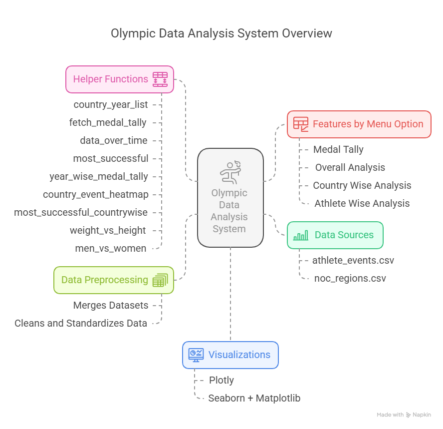

# Olympic Analysis Web App

## Overview

This web application provides an in-depth analysis of Olympic data. It allows users to explore various aspects of the Olympics, such as medal tallies, overall analysis, country-wise performance, and athlete-wise statistics. The app leverages data visualization to present insights in a user-friendly manner.



## Features

1. **Medal Tally**: View the medal tally based on selected years and countries.
2. **Overall Analysis**: Explore top statistics and trends over the years, including the number of editions, host cities, sports, events, athletes, and participating nations.
3. **Country Wise Analysis**: Analyze the performance of specific countries over the years, including medal tallies and top athletes.
4. **Athlete Wise Analysis**: Examine athlete-specific data, including age distribution, performance in various sports, and physical characteristics.

## Installation

1. Clone the repository:
   ```sh
   git clone https://github.com/yourusername/olympic_analysis_web_app.git
